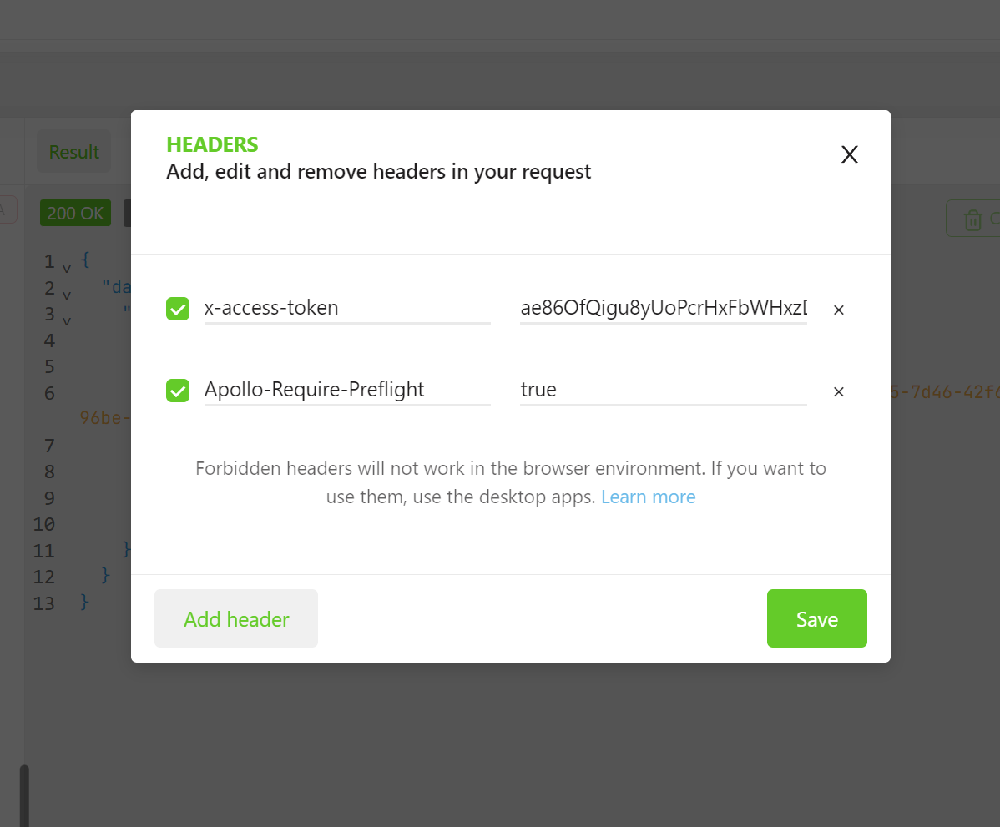
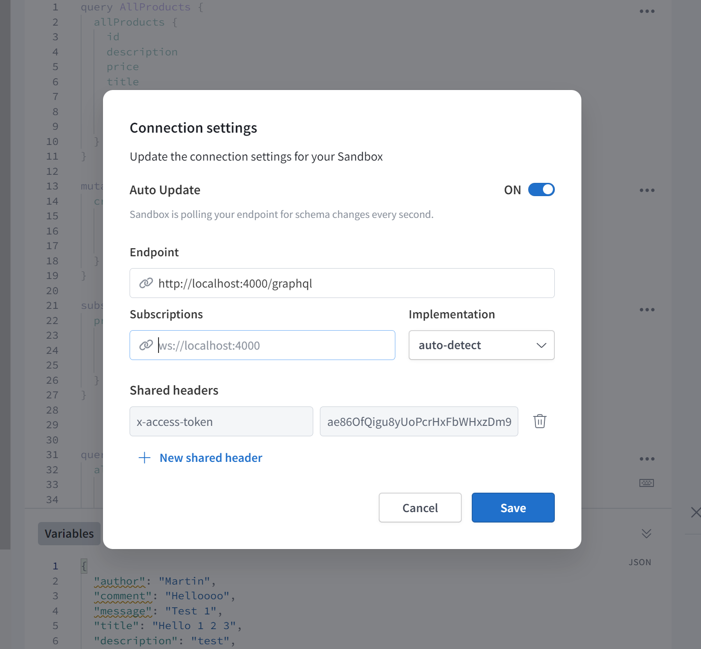

# GraphQL Server API

Simple GraphQL server for managing products, categories, and images.

## Table of Contents

- [Introduction](#introduction)
- [Getting Started](#getting-started)
- [Clone the repository](#clone-the-repository)
- [Install dependencies](#install-dependencies)
- [Configure environment variables](#configure-environment-variables)
- [Install MongoDB](#install-mongodb)
- [Start the server](#start-the-server)
- [Uploading Images](#uploading-images)
- [Deleting Images](#deleting-images)
- [Linking Products and Categories](#linking-products-and-categories)
- [Authentication](#authentication)
- [Conclusion](#conclusion)
- [Contributing](#contributing)

## Introduction

This is the documentation for the GraphQL server that provides an API for managing products, categories, and images. The data is stored in MongoDB and the server is built using GraphQL.

## Getting Started

In order to run the server, you will need to have Node.js and MongoDB installed.

## Clone the repository

Clone the repository using the following command:

```bash
git clone git@github.com:martinholecekmax/graphql-server-api.git
```

## Install dependencies

Navigate to the project directory and run the following command:

```bash
npm install
```

**Note:** Nodemon is used for development. If you don't have it installed globally, you can install it with following command:

```bash
npm install -g nodemon
```

## Configure environment variables

Either create a `.env` file or rename `.env.example` to `.env` and fill in the values.

## Install MongoDB

You can either install MongoDB locally or use a cloud service like [MongoDB Atlas](https://www.mongodb.com/cloud/atlas)

After installing MongoDB, create a user with read and write permissions to the database

Following is an example of how to create a user in the MongoDB shell:

```bash
use test
db.createUser({"user" : "test","pwd": "password","roles" : [{"role" : "read","db" : "test"},{"role" : "readWrite","db" : "test"}],"mechanisms" : ["SCRAM-SHA-1","SCRAM-SHA-256"]})
```

**Note:** Use the same database name, username, and password in the `.env` file. Also, make sure to use strong passwords in production.

## Start the server

To start the server, run the following command:

```bash
npm start
```

Server will start on port 4000 by default (can be changed in `.env` file) and the GraphQL playground will be available at `http://localhost:4000/graphql`

## Uploading Images

The server allows images to be uploaded and stored in a AWS S3 bucket. The following environment variables need to be set in order to upload images:

```bash
AWS_BUCKET_NAME=''
AWS_BUCKET_REGION='eu-west-1'
AWS_ACCESS_KEY=''
AWS_SECRET_ACCESS=''
AWS_BUCKET_PUBLIC_URL=''
AWS_ROOT_DIRECTORY=''
```

**Note:** The `AWS_BUCKET_PUBLIC_URL` is the URL of the bucket. The `AWS_ROOT_DIRECTORY` is the directory where the images will be stored.

The URL of the image file is stored in the mongoDB database.

You can upload images using the `uploadImage` mutation. The GraphQL playground does not support uploading files, however, you can use a tool like [Altair GraphQL Client](https://altairgraphql.dev/) which can be installed as a Chrome extension to upload images.

The following is an example of how to upload an image using the Altair GraphQL Client:

```graphql
mutation UploadImage($file: Upload!) {
  uploadImage(file: $file, alt: "Description of the image") {
    id
    alt
    url
    fileName
    imageType
    createdAt
    rootDirectory
  }
}
```

You have to select the `file` variable and choose the image file from your computer.

To add previously uploaded image to a product, you have to update existing product using the `updateProduct` mutation and add the image `id` to the images array. The following is an example of how to update a product:

```graphql
mutation UpdateProduct($images: [ID], $updateProductId: ID!) {
  updateProduct(images: $images, id: $updateProductId) {
    id
    images {
      id
      alt
      url
      fileName
      imageType
      createdAt
      rootDirectory
    }
  }
}
```

You have to set following variables in the `Variables` section:

```json
{
  "images": ["image-id-from-the-database"],
  "updateProductId": "product-id-from-the-database"
}
```

This approach of uploading images and then linking them to products might not be the best solution because it requires two requests. However, it's a good starting point for a simple application.

You could add uploading images to products in a single request by adding upload logic to the `updateProduct` mutation, but that's not ideal in some cases and it would lead to code duplication if you want to use the same logic in categories or other types.

This depends on your use case and you should choose the best solution for your application.

## Deleting Images

You can delete images using the `removeImage` mutation which removes the image from the database, but not from the AWS S3 bucket. This is because sometimes you might want to keep the image in the bucket for future use.

The following is an example of how to delete an image:

```graphql
mutation RemoveImage($removeImageId: ID!) {
  removeImage(id: $removeImageId) {
    id
    fileName
    createdAt
    alt
    imageType
    rootDirectory
    url
  }
}
```

You have to set following variables in the `Variables` section:

```json
{
  "removeImageId": "image-id-from-the-database"
}
```

You can add the logic to delete the image from the bucket if you want to by using `removeFile` function that can be found in `services/s3.js` file and calling this function in the `removeImage` mutation.

I've commented out the code that deletes the image from the bucket in the `removeImage` mutation, but you can uncomment it if you want to add this functionality. You have to import the `removeFile` function if you uncomment the code.

The image is only deleted from `images` collection in the database and not from the products `images` array. You have to update the product and remove the image from the `images` array and send the updated product to the `updateProduct` mutation in separate requests.

## Linking Products and Categories

Each product can be associated with a category. Products and categories can be linked by using the `products` field in the `Category` type. This field is an array of `Product` types. This allows products to be grouped and filtered by category.

## Authentication

It's a good practice to protect your GraphQL API with authentication, especially if you are using it for a production application. This server uses simple authentication using hardcoded access key sent in the `x-access-token` header. The access key is stored in the `.env` file and is used to verify the user.

```bash
# .env
API_KEY='ae86OfQigu8yUoPcrHxFbWHxzDm91ZJxp0lSlm2I'
```

Following image shows how to add the access key in the `Headers` section of the Altair GraphQL Client.



I also had to add the `Apollo-Require-Preflight` header in the `Headers` section of the GraphQL playground and set it to `true` in order to avoid the `CSRF` blocked error.

You can also use the GraphQL playground to test the API and add the access key in the HTTP Headers section as shown in the following image. However, the GraphQL playground does not support sending the image file that is required for the `uploadImage` mutation.



The access key is used only for mutation operations, however, it could be used for queries as well by adding the middleware function `authenticate` from `middlewares/auth.js` to the resolver function. This will automatically check if the user is authenticated before executing the query. If the client does not send the access key in the `x-access-token` header or if the access key is invalid, the query will return an error `Not authenticated`. Queries can be executed without the access key. This is useful for public data that can be accessed by anyone which could be useful in some cases.

The access key is used only for demonstration purposes. In a production application, you should use a more secure method of authentication.

## Conclusion

This GraphQL server provides a flexible API for managing products, categories, and images. The data is stored in MongoDB and the server supports a range of queries and mutations for accessing and updating the data.

The server also supports uploading images to a AWS S3 bucket. The URL of the image file is stored in the mongoDB database.

The server is built using Node.js, Express, GraphQL, MongoDB, and Mongoose.

## Contributing

If you have any suggestions or find any bugs, please create an issue or submit a pull request.
